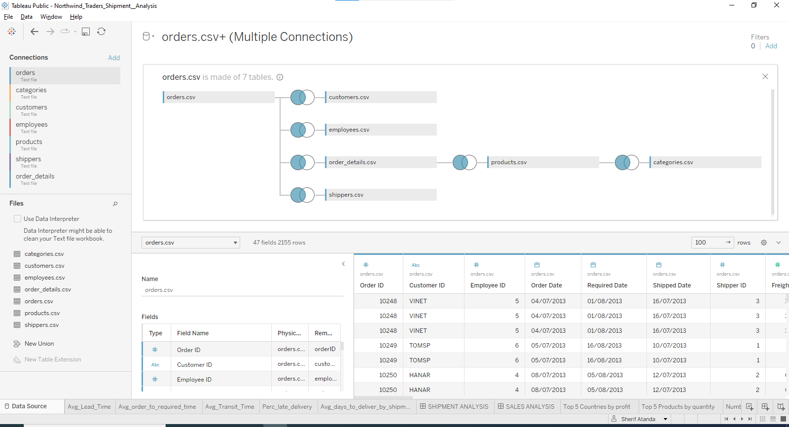
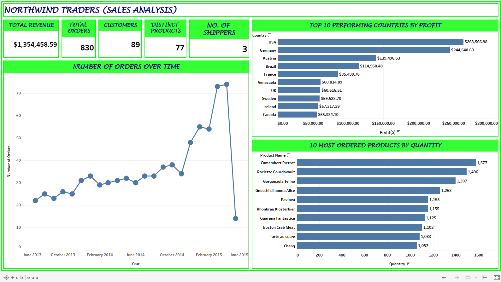
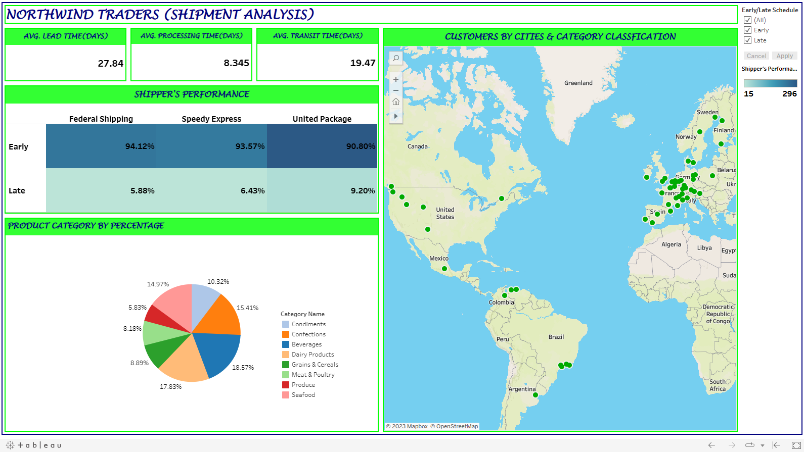

# Northwind_Traders

## INTRODUCTION
Data Fellow is a data community whose aim is to create a central point for data analysts, provide opportunities such as job opportunities and bootcamps, and offer help to anyone in need of help in the field. This brings me to another goal, which also involves organising data challenges. This is one of them, and I thought to make this one of my projects and add it to my portfolio.

## ABOUT THE DATASET
The dataset used is called the Northwind Traders. Here is a little finding I made concerning the dataset. The Northwind database is a sample database that was originally created by Microsoft and used as the basis for their tutorials in a variety of database products for decades. The Northwind database contains the sales data for a fictitious company called “Northwind Traders,” which imports and exports specialty foods from around the world.

The datasets contain seven tables. The names of the tables and their columns are below:
- Categories: Category ID, category name, description.
- Customers: Customer ID, company name, contact name, contact title, city, country
- Employees: Employee ID, employee name, title, city, country, reports to
- Order Details: Order ID, Product ID, Unit Price, Quantity, Discount
- Orders: Order ID, customer ID, employee ID, order date, required date, shipped date, shipper ID, freight
- Products: Product ID, product name, quantity per unit, unit price, discontinued, category ID.
- Shippers: Shipper ID, company name.

## PROBLEM STATEMENT
As a data analyst, my purpose is to highlight my skills and reveal the potential of visual storytelling. This task presents an incredible chance to delve into the world of data visualisation and convert unprocessed data into captivating visuals.

## DATA MODEL

## FINDINGS & VISUALIZATIONS

### SALES ANALYSIS DASHBOARD

To interact with the dashboard, [Click_here.](https://public.tableau.com/app/profile/sherif.atanda/viz/Northwind_Traders_Sales_Analysis/SALESANALYSIS?publish=yes)

### SHIPMENT ANALYSIS

To interact with the dashboard, [Click_here.](https://public.tableau.com/app/profile/sherif.atanda/viz/Northwind_Traders_Shipment__Analysis_Final/SHIPMENTANALYSIS?publish=yes)

## INSIGHT
1. From the Sales analysis dashboard, it is seen that the total revenue, total number of orders, number of customers, distinct products sold, and number of shippers are presented.
2. The number of orders by customers over time increased from July 2013 and got to its peak in December 2015. This was accompanied by a drastic decrease in May 2015.
3. Charts visualising the top 10 countries based on profit generated by the company were presented. Also, with the top 10 products as demanded by quantity.

Note: A feature in Tableau was used to prevent the need to click certain parts of the charts. So, by hovering around the chart, other charts can interact.

4. Information from this feature is this: As of April 2015, the USA had made 72 orders with 332 quantities of Raclette Courdavault, which amounted to a sale of $34,221.48.
 
  It is necessary that some Key Performance indicators be included, like delivery schedule status (Early or late), how the different shippers are performing, countries and 
  categories of products purchased, etc.This is where the second dashboard (shipment analysis) comes into play.
 
5. The Average Lead Time is the period from when the order was placed to when it was delivered. In this case, the delivery time is the required date, since it was not provided in the dataset if the required date was exceeded or not.
6. The Average Processing Time Is the period from when the order was placed to when it was shipped.
7. The Average Transit Time is the period from when the order was shipped until it was delivered as required.
8. Delivery status can be classified as either early or late.This is achieved by subtracting the shipment date from the required date. Whenever the shipment date exceeds 
   the required date, then the delivery is termed late. Otherwise, it is early. This was classified based on the three shippers (Federal Shipping, Speedy Express, and 
   United Package). The filter button at the right uppermost corner reveals which countries experience early and late deliveries. This can be found in the shipper's Performance chart.
9. Every product sold by the Northwind traders has various categories. In the map present in the shipment analysis dashboard. The most purchased product categories are 
   Beverages, Confections, seafood, etc. This can be found in the product category by percentage chart.
   A deep dive was taken to identify some cities and the categories of products purchased the most. Walla Walla, USA, purchased more diary products and sea food than any 
   other customer.
   Some cities in France, like Nantes, Lyon, Paris, etc., purchased beverages at a high percentage compared to other cities.
10. Customers by Cities and Category Classification displays cities and the percentage of product categories they purchase. A filter is also present to identify customers who experienced late or early delivery.

## RECOMMENDATION
1.	Since the majority of the customers are from European countries, which is an indicator that sales generated in that region are high. It is also in this region that late 
    delivery occurs the most. The Company should look into the shippers responsible for this and increase efficiency.
2.	Though the shippers used made early deliveries of over 90%, there should be improvement. There should be a contingency plan, as this will help meet delivery commitments 
    even in the event of disruption.
3.	There should be continual monitoring of on-time delivery to identify areas for improvement. This may be per month, etc.
4.	Service Level Agreements (SLAs) should be employed. SLAs, or service-level agreements, are contracts between two parties that define the level of service that one party 
    expects from the other. This ensures on-time delivery, product quality, minimising damage during shipping, etc.
 
## CONCLUSION
  This challenge revolves around what is termed supply Chain Analytics. Supply chain analytics is the process of collecting, analysing, and interpreting data from a company's 
  supply chain to gain insights that can be used to improve efficiency, reduce costs, and improve customer service. It can be further divided into the descriptive, 
  prescriptive, and predictive parts.So far, the analysis done features the descriptive and prescriptive parts.

